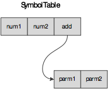
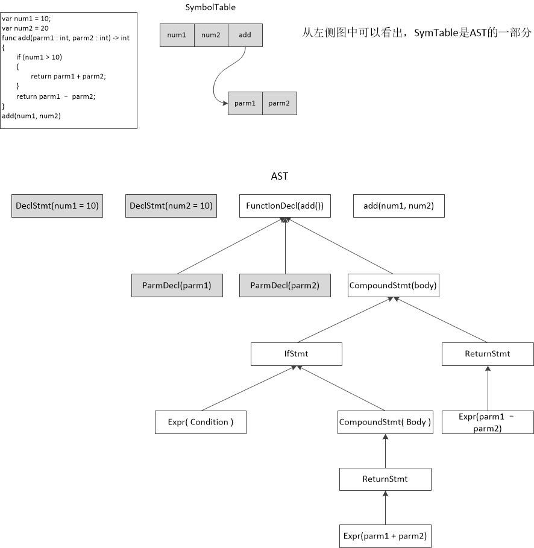

# 关于SymbolTable
SymbolTable在编译器理论中，是一个很重要的结构，一般用于semantic analysis。但是关于SymbolTable有一些迷惑：
 - Clang前端使用的SymbolTable和LLVM使用的SymbolTable是不是一回事？
 - 在编译器的编写过程中前端的SymbolTable可不可以复用到后端代码生成处？

为了说明上面这个问题，我们先来看一部分代码。

这是一段非常简单的moses代码，这里出现的符号也很简单总共有4个符号，我们构造出的符号表如下图所示：

符号表的构造是在进行语法分析的时候，边parse边构造的，并且用于Semantic Analysis（TypeChecking）。

> A symbol table maps identifiers (typically prefixed by a scope name) to information about that identifier, such as its symbol type(local variable / parameter / function / class etc.), data type, its order relative to the other identifiers in the same scope, its source code line, etc. The symbol table can be generated by traversing the abstract syntax tree, by always keeping track of which scope you’re in and adding information to the symbol table whenever you hit a variable declaration. -[How to make a symbol table][1]

对应的AST树如下：

从AST中，我们可以看出SymbolTable只是AST树的一小部分，也就是语法树中decl的一小部分。

对于第一问题的回答是，两者不同。Clang前端的SymbolTable用于前端编译时使用的，这里没有（中间语言中含有临时变量）临时变量。LLVM的SymbolTable用于标识IR指令中的 `<name, info>` 的信息，例如`add %num, %1`，我们需要记录`<%num, > <%1, >`这些信息，这些信息只能说与Clang前端的SymbolTable有一部分交叉，但是如果使用mem2reg对local variable进行promotion后就不存在local variable了。

>The LLVM in-memory representation of its IR does not use a symbol table. Instructions contain memory links to their operands(and their users), so if you have an instruction and wants to access its operand, just follow the link, you do not have to perform a lookup in any symbol table.
> 
>There are some lists accociated with LLVM contexts, modules, functions and basic blocks, which allow you to access the contatined elements, but they are mostly just lists, not tables associating a name with anything. Of course, if you want to parse a textual IR file(II), you would probably need a symbol table (or something) to do so and create the above-mentioned links; but there’s little reason to that seeing that LLVM already contains such a parser (and that parser indeed uses some way to associate a “name” with a value – see the implementation of the BitcodeReader ).
> 
> As for LLVM front-ends for generating IR – that is up to you. I’d say that if you want to parse a C-like language, using a symbol table would be really useful. - [How symbol table handling is done in LLVM based compiler?][2]

从上面的英文描述中我们可以看到，LLVM的symbol table使用来维护IR之前的联系的，是一种`<name, value>`对，其中value就是LLVM中`Instruction`、`BasicBlock`以及`Function`的基类。该symbol table是我们解析textural IR file时候使用的，在in-memory IR中是不需要的。

但是这里出现一个问题，就是我们在遍历AST进行code generation的时候，需要预先获知各个变量所对应的符号（此时我们并不需要LLVM的symbol table，而是source code的symbol table）。所以我们需要复用Clang前端的symbol table或者在遍历语法树的时候重新创建一个，暂时给出的解答是直接复用之前的就好（毕竟symbol table和AST相比是要简单的多，并没有必要再遍历AST创建）。需要注意的地方就是，在编译语法树的时候，在进入一个新的scope的时候，需要对应的进入symbol table的scope。

[1]: http://stackoverflow.com/questions/8534789/how-to-make-a-symbol-table?rq=1
[2]: http://stackoverflow.com/questions/13089015/how-symbol-table-handling-is-done-in-llvm-based-compiler